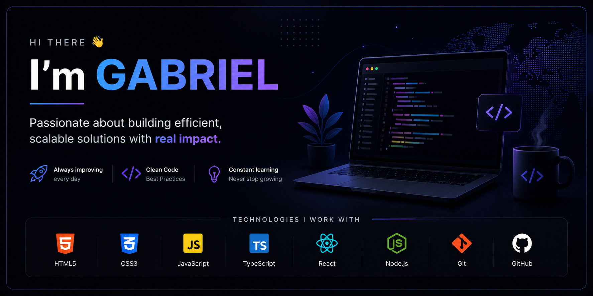

# 👋 Hi, I'm Gabriel

🎓 I'm an Information Technology student with a strong interest in systems, software development, and cybersecurity.

💡 I am motivated by understanding how technology works at a deeper level, especially how systems operate, how vulnerabilities arise, and how they can be prevented or mitigated. I enjoy learning by doing, analyzing real scenarios, and continuously improving my technical skills.

🧠 My current skill set includes:
- Fundamental knowledge of Git and version control workflows
- Programming with Python for problem-solving and scripting
- Web development fundamentals (HTML, CSS, JavaScript)
- Basic understanding of operating systems and system behavior

🔐 I am currently focusing on:
- Cybersecurity fundamentals (systems, networks, security concepts)
- Understanding vulnerabilities and attack methods

🚀 My goal is to become a cybersecurity professional capable of identifying vulnerabilities, analyzing systems, and contributing to secure applications and infrastructure.

📌 This profile showcases my projects, practice work, and continuous learning process.

---
## 🛠️ Technologies

### 🎨 Frontend

### 🧠 Backend

### 🎯 Design Stack

### ⚙️ DevOps Stack

## 📂 Projects
- Coming soon...

## 📫 Contact
- Gmail:gabrijhoan2006@gmail.com
